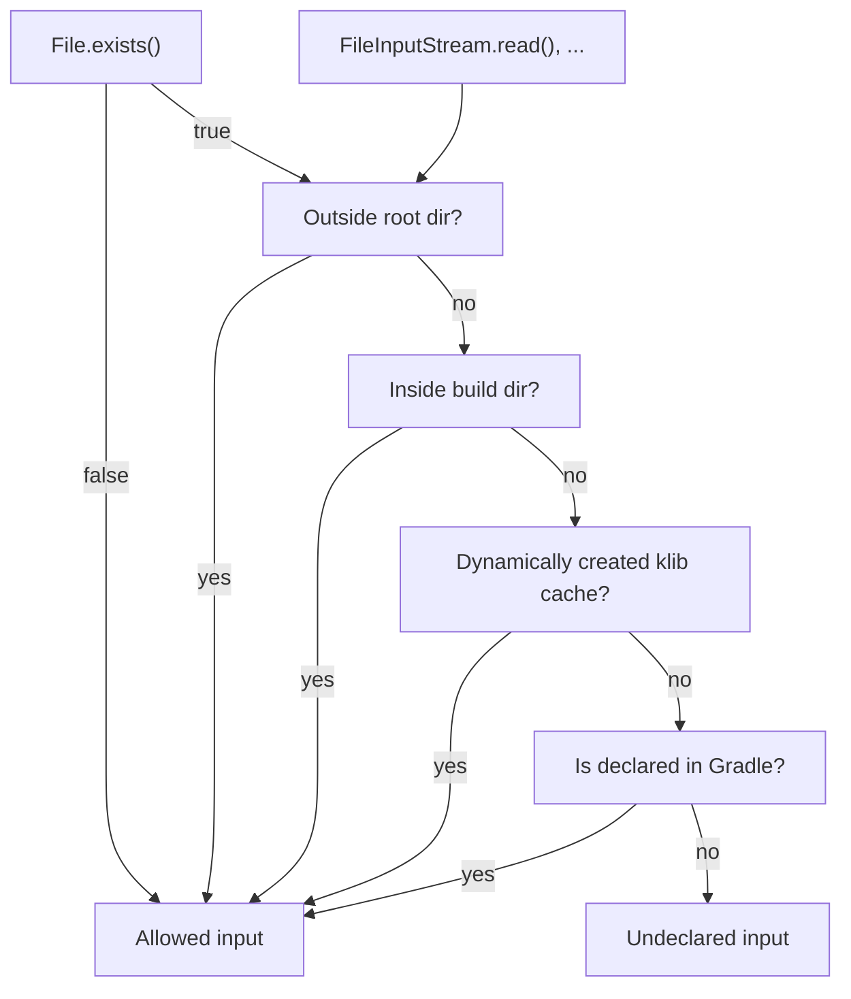
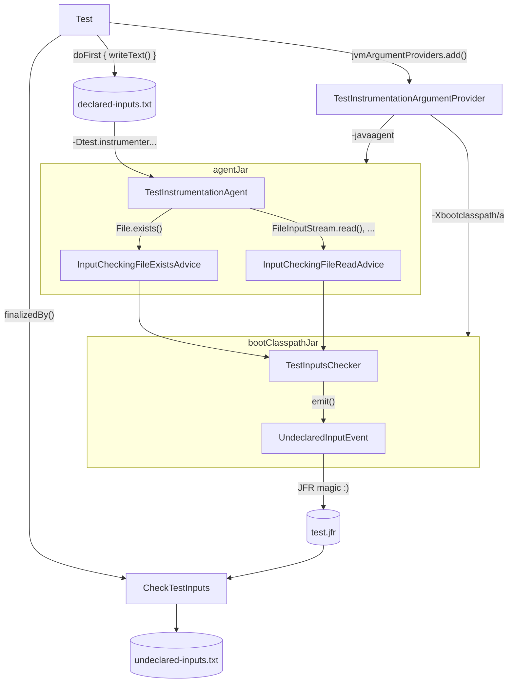

# test-inputs-check-v2

This convention plugin verifies that your tests don't read files which are not declared as Gradle inputs.

It's a successor of `test-inputs-check` (v1). Either `test-inputs-check` or `test-inputs-check-v2` must be applied to make the tests
cacheable.

Under the hood, it applies `java-flight-recorder` convention to configure Java Flight Recorder for test execution.
See [java-flight-recorder/README.md](../java-flight-recorder/README.md) for available configuration options.

## Usage

```kotlin
plugins {
    id("test-inputs-check-v2")
}

// all config options with their default values
testInputsCheck {
    enabled = true
    failFast = false
}
```

Run your tests, for example:

```bash
./gradlew :native:kotlin-klib-commonizer:test
```

If there are any undeclared inputs detected, the build will fail, and the error message will point you to the JFR snapshot file:


Open it in IDEA, then go to: `Events | Uncategorized | jetbrains.UndeclaredInput`:


Now you can explore the stacktrace to identify where exactly the undeclared input has been accessed.

## Which files are considered inputs?

(install [Mermaid Visualizer IntelliJ Plugin](https://plugins.jetbrains.com/plugin/30432-mermaid-visualizer) if the diagram is not
automatically rendered)



### Allowing files outside the root project directory

We allow reading files outside the root project directory (like `~/IdeaProjects/kotlin`).

Why? Because these files are not produced by our build. They are either useless to cache or be tracked by other Gradle mechanisms.

Some examples:

1. `GRADLE_USER_HOME` / `GRADLE_RO_DEP_CACHE` — a jar at `~/.gradle/caches/.../foo-1.0.0.jar` cannot silently change; if a dependency
   version changes, Gradle's own input tracking already invalidates the task.
2. JDK toolchain directory — already captured by `javaLauncher.metadata.languageVersion`. The JDK's individual files don't need to be
   declared one by one; the Java version is the input.
3. System temp dir — by definition transient, test-local space to be thrown away.
4. System binaries (`/bin/sh`, `/usr/bin/tar`) — these are environment, not inputs. Tracking them as inputs would either be useless (they
   almost never change) or catastrophic (every OS update busts every cache). The correct model is "this test requires tool X to be present",
   not "this test's output depends on the bytes of `/bin/tar`".
5. Konan — mostly we read `kotlin-native/dist`. We only read `~/.konan` in case the bootstrap version of K/N is required (for that we use
   `NativeCompilerDownloader` and pass the path via system property). In both cases, the Konan dist is declared as a Gradle input (in the
   second case it's not strictly necessary because `konanVersion == kotlinBootstrapVersion`, which is already tracked as an input).
6. Xcode — we track the Xcode toolchain version via `XcodeValueSource`; no need to add particular binaries like `clang`, `ld`, or `libtool`
   as inputs
7. `/dev/random`, `/dev/urandom` — these cannot be inputs in any meaningful sense.

### Allowing files inside the current project's build directory

Most of the files in the project's build directory are already tracked as inputs, but sometimes it happens that test code writes some files
to that directory and then reads them back.

To support such cases, we simply allow all reads from the build directory.

### Allowing files from dynamically created klib cache

The files in `kotlin-native/dist/klib/cache` are written dynamically during test execution and then read back. We don't consider them 
inputs, thus we allow reading them in `TestInputsGuard`.

There is only one exception: the stdlib cache. It is produced by `:kotlin-native:distStdlibCache` and written into 
`.../klib/cache/{target}-gSTATIC-system/stdlib-per-file-cache`. Files inside this directory are not unconditionally 
allowed to read because they are not dynamically created.

### Allowing non-existent files

We allow files for which `File.exists()` returned `false`.

Why?

#### Reason 1: Reduce the noise of false positives

If we didn't allow `File.exists() == false`, it would produce a ton of false positives.

The majority of cases is like this:

```kotlin
if (file.exists()) {
    // do something with this file
} else {
    // fall back to some default strategy or config
}
```

Most often the fallback strategy is what the test author expects. If the test runs fine with the defaults, there is no point in declaring
the optional file as an input.

Or a different case:

```kotlin
val syntheticClass = generateSyntheticClass()
assertThat(syntheticClass.sourceFile).doesNotExist()
```

In that case, the only way to fix the false positive would be to either:

- explicitly tell `test-inputs-check-v2` to allow it
    - that would require maintaining a hand-crafted whitelist that can grow huge (as it was the case for `test-inputs-check` v1)
- modify the code
    - but the code is perfectly valid, it generates a synthetic class and asserts that its source file does not exist

If a test actually needed that file, it would just fail in case it doesn't exist.

#### Reason 2: Observation of a file absence can't be an input

When a file does not exist, it's not possible to add it as an input. We can try to do it like this:

```kotlin
tasks.test {
    inputs.file("foo.txt").optional(true)
}
```

but Gradle will fail with the following error:

```
An input file was expected to be present but it doesn't exist
```

Ultimately, Gradle's input system can't express the "observation of a file absence" as a task input.

#### The trade-off

Ignoring non-existent files gives us many benefits, but it also comes at a cost.

Let's say we have a test that asserts that a file is absent. When we create that missing file, the test is supposed to fail, but instead it
will be taken from the cache.

We accept this risk as a trade-off, because:

- it's a theoretical situation
- even if it occurs, the over-cached test will self-heal as soon as any other input is changed
- we still execute all the tests on `master`, so we have a safety net to catch this kind of issues

## How does it work?

Every `Test` task created via `project-tests-convention` is instrumented as shown on the following diagram:

(install [Mermaid Visualizer IntelliJ Plugin](https://plugins.jetbrains.com/plugin/30432-mermaid-visualizer) if the diagram is not
automatically rendered)



### How is the Java Agent registered?

That's the job of `TestInstrumentationArgumentProvider`.

It provides the following JVM options:

- `javaagent:/path/to/test-instrumenter.jar` (agentJar)
    - points to the main agent jar
    - that jar contains the premain function and advice classes
- `-Xbootclasspath/a:/path/to/test-instrumenter-boot-classpath.jar` (bootClasspathJar)
    - appends the given jar to the Boot Classpath
    - it is necessary, because we instrument classes that are loaded by the Bootstrap Class Loader (like `java.io.FileInputStream`), which
      doesn't have access to the main agent jar
    - note that the bytecode from our advice classes is injected directly to the instrumented classes, so any class accessed from a method
      annotated with `@Advice.OnMethodExit` must be placed in the boot classpath jar

### How are the undeclared inputs collected?

- As its first action, `Test` task writes its input paths to `declared-inputs.txt`
- A path to that file is passed via system property to `TestInstrumentationAgent`
- The `TestInstrumentationAgent` uses ByteBuddy to register advices: `InputCheckingFileExistsAdvice` and `InputCheckingFileReadAdvice`
- The bytecode from advices is injected at the end of instrumented methods
- Both of the advices delegate execution to `TestInputsChecker`
- The `TestInputsChecker` takes a file path as argument and checks whether it's not found in `declared-inputs.txt` (among other checks)
- In that case, it emits `UndeclaredInputEvent` (visible to JFR as `jetbrains.UndeclaredInput`)
- At the end of test execution, all JFR events are dumped to `test.jfr` (the name of this file depends on the test task, so for
  `functionalTest` it would be `functionalTest.jfr`)

### How is the user informed about verification results?

Every `Test` task is finalized by its `CheckTestInputs` counterpart.

For example:

- `test` -> `checkInputsForTest`
- `functionalTest` -> `checkInputsForFunctionalTest`
- etc.

The `CheckTestInputs` task takes `test.jfr` snapshot, reads its contents via built-in Java API, and throws an error if there is at
least one undeclared input.

In any case, it produces the `undeclared-inputs-for-{taskName}.txt` file (can be empty), so the `CheckTestInputs` task  can be cached.

